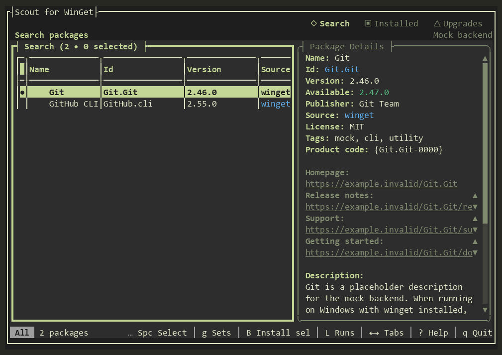

# Scout for WinGet

**WinGet Scout** brings Windows package management into your terminal. Search for software, inspect package details, install and upgrade packages, manage pins, and review what happened after each run. It uses the WinGet COM API when available and falls back to the `winget` command-line tool.

[](https://github.com/harder/wingetscout/actions/workflows/ci.yml)
[](https://www.microsoft.com/windows)
[](LICENSE)

[Website](https://wingetscout.com/) · [Documentation](https://wingetscout.com/docs.html) · [Releases](https://github.com/harder/wingetscout/releases)



[Watch search in action](site/media/scout-search-demo.gif) · [Watch the upgrades view](site/media/scout-upgrades-demo.gif) · [See all four themes](https://wingetscout.com/#themes). These captures use Scout's safe `--mock` mode and show sample packages.

## Install

**Recommended: download the portable ZIP** from [GitHub Releases](https://github.com/harder/wingetscout/releases). It includes `wingetscout.exe` and the companion files needed for the full WinGet COM experience. No .NET runtime or installer is required.

A WinGet community package is being prepared as `Harder.WinGetScout`. Use the release ZIP until the [community submission](packaging/WINGET-SUBMISSION.md) is accepted.

After that package is accepted, `winget install -e --id Harder.WinGetScout` will install the ZIP into WinGet's managed portable directory and add `wingetscout` to your user `PATH`. Open a **new terminal** to use the command from any folder. The WinGet manifest already requests this behavior; it does not require a separate installer or manual PATH editing. WinGet verifies the downloaded ZIP hash, but it does not sign the executable. See [signing and distribution](code-signing.md).

1. Choose the ZIP for your Windows PC:

   | PC | Download |
   | --- | --- |
   | Intel or AMD (x64) | `wingetscout-<version>-win-x64.zip` |
   | ARM (arm64) | `wingetscout-<version>-win-arm64.zip` |

2. Extract the ZIP to a folder you can keep, such as `%LOCALAPPDATA%\Programs\WinGetScout`. Keep **all** extracted files together; the COM backend needs the DLLs beside `wingetscout.exe`.
3. Open that folder in Windows Terminal or PowerShell and run:

   ```powershell
   .\wingetscout.exe
   ```

Scout requires Windows 10 or 11 and [WinGet](https://learn.microsoft.com/windows/package-manager/winget/) (included with current App Installer). Check that WinGet is available with `winget --version`; if the command is missing, install or update App Installer. Windows Terminal is recommended for the best display. If you enable scheduled update checks, leave the extracted folder at the same path so the scheduled task can find the executable.

### Other downloads

- **Single executable:** `wingetscout-x64.exe` or `wingetscout-arm64.exe` is the smallest portable option. It runs through the `winget` CLI because the COM companion files are not included. Run the downloaded filename directly, for example `.\wingetscout-x64.exe`.
- **MSIX:** This is not a release download yet. See the [signing plan](code-signing.md) for the work needed before a signed package can be offered.

Portable downloads are currently unsigned. If Windows shows a SmartScreen warning, verify that the file came from this repository's release page and compare its SHA-256 hash with the release's `SHA256SUMS` file before choosing **More info → Run anyway**. You can also right-click the downloaded file, open **Properties**, and select **Unblock** when Windows offers it. See [code signing](code-signing.md) for the current signing status.

## What you can do

- **Search:** Find packages across available WinGet sources, inspect publisher, version, description, links, and other details, then install a package or choose a specific version.
- **Review an install plan:** Select search results and preview a source-aware plan before installing. Scout checks the installed inventory and marks entries it cannot resolve or install.
- **Manage installed packages:** Browse and filter your installed software, upgrade or uninstall it, and manage pins. With the COM backend, you can also verify or repair supported installs.
- **Handle upgrades together:** Select several upgrades, review the plan, and run the ready items as a batch.
- **Keep useful context:** Save package sets for later, export visible lists to CSV, and inspect recent runs with success, skip, and failure results.
- **Check for updates on a schedule:** Set a daily check and optionally receive a Windows notification when an unpinned upgrade changes or a check fails. Checks never install updates automatically.

The **Search**, **Installed**, and **Upgrades** tabs share a package list and detail panel. Use the arrow keys or `j`/`k` to move, `←`/`→` to switch tabs, and `?` for the complete in-app help.

| Key | Action |
| --- | --- |
| `/` | Search or filter the current list |
| `i` / `I` | Install the highlighted package / choose a version |
| `u` / `x` | Upgrade / uninstall the highlighted package |
| `Space` / `a` | Select one / all visible packages |
| `B` | Review selected search results before installing |
| `U` | Review and upgrade selected packages |
| `g` | Save, load, or delete package sets in Search |
| `C` | Open update-check settings in Upgrades |
| `L` | View recent run results |
| `p` / `P` | Pin or unpin a package / cycle the pin filter |
| `t` / `?` / `q` | Choose a theme / open help / quit |

The status bar shows the shortcuts relevant to the current tab. Scout also supports mouse input, sorting, source filters, download-only and advanced installs, and direct homepage or changelog links.

## Scheduled update checks and local data

In **Upgrades**, press `C` to run a check now or schedule one at a daily local time. A schedule creates a current-user Windows Task Scheduler task. The first successful check establishes a baseline; later checks can notify you about new or changed unpinned upgrades, or a failed check. Disable the schedule from the same dialog to remove the task. Windows notification settings still control whether toasts appear.

Scout stores package sets, recent run results, check results, and schedule settings under `%LOCALAPPDATA%\WinGetScout`. These are local files. The `L` view shows the 20 most recent operation runs. A scheduled check reads package state; it does not install or upgrade anything.

## Backends and capabilities

The portable ZIP uses the structured **WinGet COM API** by default. If COM cannot activate, Scout falls back to the `winget` CLI and reports the active backend in its header. The standalone `.exe` download uses the CLI backend because it does not include the COM files. Pin operations use the CLI in either case.

COM enables richer package details, installer previews and version lists, live progress, and supported verify or repair operations. Search, install, upgrade, uninstall, pinning, saved sets, run history, and scheduled checks remain available through the CLI backend; some detail fields and actions depend on what that backend exposes. See [known limitations](feature-gaps.md) and [COM activation details](com-activation.md).

## Inspiration and credits

[Scott Hanselman's **winget-tui**](https://github.com/shanselman/winget-tui), built with Rust and Ratatui, inspired this project and deserves credit for showing how approachable WinGet can be in a terminal. Scout began as a C# exploration of what [Terminal.Gui](https://github.com/gui-cs/Terminal.Gui) could do with that kind of experience. It has since developed into an independent package manager with its own workflows, design, and release builds. No source code was copied from the inspiration project.

Scout for WinGet is [MIT licensed](LICENSE). WinGet is maintained by [Microsoft](https://github.com/microsoft/winget-cli); Terminal.Gui is maintained by its [contributors](https://github.com/gui-cs/Terminal.Gui).

## Development

Development requires the .NET 10 SDK. The application targets both `net10.0` (cross-platform UI and CLI/mock backends) and `net10.0-windows10.0.26100.0` (Windows COM backend). A Native AOT publish requires Windows and Visual Studio C++ build tools.

### Build from source

Clone the repository, then publish for your Windows architecture:

```powershell
git clone https://github.com/harder/wingetscout.git
cd wingetscout

# Intel or AMD
dotnet publish WinGetScout.csproj -c Release -f net10.0-windows10.0.26100.0 -r win-x64
.\bin\Release\net10.0-windows10.0.26100.0\win-x64\publish\wingetscout.exe

# Or, on Windows ARM
dotnet publish WinGetScout.csproj -c Release -f net10.0-windows10.0.26100.0 -r win-arm64
.\bin\Release\net10.0-windows10.0.26100.0\win-arm64\publish\wingetscout.exe
```

Keep the complete `publish` folder for COM support. For UI work on Windows, Linux, or macOS, run `dotnet run -f net10.0 -- --mock` to use sample packages without changing the machine's package state. On Windows, `dotnet run -f net10.0-windows10.0.26100.0 -r win-x64` (or `win-arm64`) exercises the COM-capable build.

Run the tests with:

```powershell
dotnet test --project tests/WinGetScout.Tests.csproj
```

The test project uses Microsoft.Testing.Platform, so pass it with `--project`. For contributor setup and code style, see [CONTRIBUTING.md](CONTRIBUTING.md). For backend diagnostics, packaging, and signing, see [com-activation.md](com-activation.md), [WINDOWS-TESTING.md](WINDOWS-TESTING.md), and [code-signing.md](code-signing.md).
